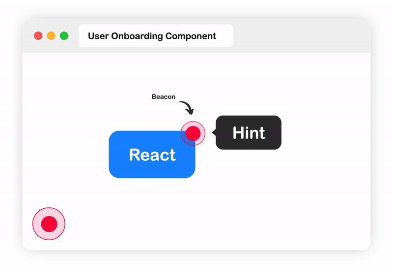

<h1 align="center">React Beacon Hint</h1>

User Onboarding Component for React with Fully Configurable Options

 

  

<a href="https://react-beacon-hint-doc.vercel.app/">📄 Documentation</a>&nbsp;&nbsp;&nbsp;|&nbsp;&nbsp;&nbsp;
<a href="https://react-beacon-hint.vercel.app/">🌐 Demo</a>

 

## ✨ Features

- 🛠 Use [Floating UI](https://floating-ui.com/) (the evolution of Popper 2) with fully configurable options as anchor positioning system.
- ⚙️ Beautiful by default, with zero-config, and can be customized.
- 📦 Light as a feather (~60kB).
- 🏖 Easy to use, just wrap `<Hint>` around your component.
- 📝 Written in `TypeScript`.
- [Read more](https://react-beacon-hint-doc.vercel.app/getting-started/installation).

## 📖 Documentation

For documentation about React Beacon Hint, please visit [our website](https://react-beacon-hint-doc.vercel.app).

The documentation is automatically generated on every commit pushed to the `main` branch from the files in [the `website` directory](website).

## 🔮 Inspiration

React Beacon Hint is heavily inspired by [Floating UI](https://floating-ui.com/).

## 🙋 Contributing

For help on setting up the repo locally, building, testing, and contributing
please see [CONTRIBUTING.md](https://github.com/moh3n9595/react-beacon-hint/blob/master/CONTRIBUTING.md).

## 🧑‍💻 Code of Conduct

All developers who wish to contribute through code or issues, take a look at the
[CODE_OF_CONDUCT.md](https://github.com/moh3n9595/react-beacon-hint/blob/master/CODE_OF_CONDUCT.md).

## 📃 License

This project is licensed under the MIT License - see the [LICENSE.md](https://github.com/moh3n9595/react-beacon-hint/blob/master/LICENSE) file for details.

## Contributors ✨

Thanks goes to these wonderful people ([emoji key](https://allcontributors.org/docs/en/emoji-key)):

<!-- ALL-CONTRIBUTORS-LIST:START - Do not remove or modify this section -->
<!-- prettier-ignore-start -->
<!-- markdownlint-disable -->
<table>
  <tbody>
    <tr>
      <td align="center" valign="top" width="14.28%"><a href="https://github.com/moh3n9595"> <b>Mohsen</b></a> <a href="https://github.com/moh3n9595/react-beacon-hint/commits?author=moh3n9595" title="Code">💻</a> <a href="#maintenance-moh3n9595" title="Maintenance">🚧</a> <a href="https://github.com/moh3n9595/react-beacon-hint/commits?author=moh3n9595" title="Tests">⚠️</a> <a href="https://github.com/moh3n9595/react-beacon-hint/commits?author=moh3n9595" title="Documentation">📖</a></td>
    </tr>
  </tbody>
</table>

<!-- markdownlint-restore -->
<!-- prettier-ignore-end -->

<!-- ALL-CONTRIBUTORS-LIST:END -->

This project follows the [all-contributors](https://github.com/all-contributors/all-contributors) specification. Contributions of any kind welcome!